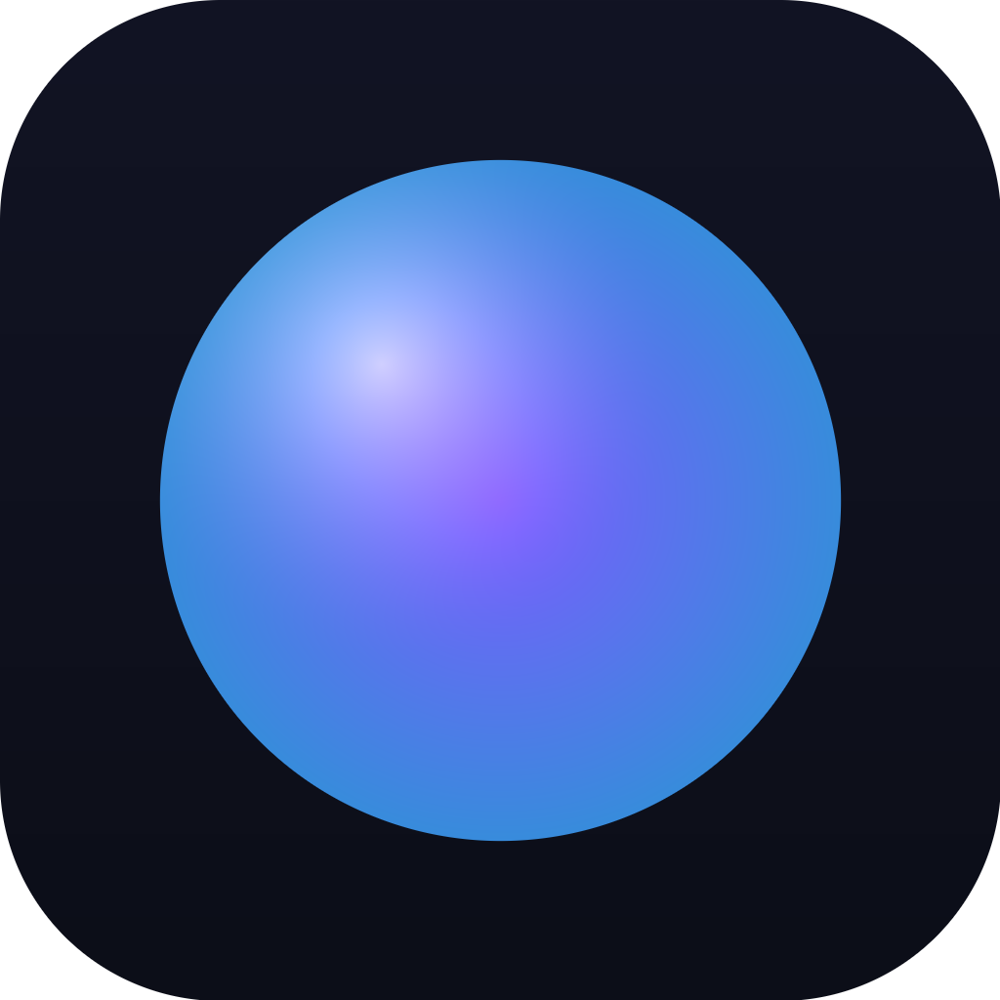

<p align="center">
  
</p>

<h1 align="center">Vivi</h1>

<p align="center">Личный AI-ассистент для Windows, Linux и macOS на моделях Claude.<br/>
Текст и голос, файлы и терминал, интернет, управление программами — через Claude Agent SDK.</p>

<p align="center"><a href="#english">English below</a></p>

---

## Что умеет

- **Команды текстом и голосом.** Push-to-talk по хоткею (`Ctrl/Cmd+Shift+Space`) открывает overlay-палитру; wake-word «Виви» слушает постоянно (офлайн). Ответы озвучиваются по предложениям, можно перебивать голосом (barge-in).
- **Настоящий агент, а не чат.** Внутри — [Claude Agent SDK](https://code.claude.com/docs/en/agent-sdk) (Claude Code как библиотека): Read/Write/Edit/Bash/Glob/Grep/WebSearch/WebFetch, подзадачи, сессии, память.
- **Два способа подключения к Claude.** По умолчанию — Agent SDK внутри приложения. Альтернатива — **ACP (Agent Client Protocol)**: Vivi запускает Claude Code как отдельный ACP-агент через официальный адаптер [`claude-agent-acp`](https://www.npmjs.com/package/@agentclientprotocol/claude-agent-acp) (тот же протокол, что в Zed и JetBrains) и общается с ним по JSON-RPC. В этом режиме можно подключить и любой другой ACP-агент (команда + аргументы в настройках); инструменты Vivi при этом передаются агенту по локальному MCP-серверу.
- **Управление компьютером.** Встроенный MCP-сервер `vivi`: скриншоты, мышь и клавиатура, окна, запуск приложений/файлов/URL, буфер обмена, уведомления, громкость/блокировка/сон, `remember` (память в `~/Vivi/memory/VIVI.md`).
- **Разрешения по категориям.** Чтение без вопросов, правки/команды/управление — с подтверждением; опасные команды (`rm -rf`, `sudo`, `shutdown`, force-push) всегда требуют подтверждения. Kill-switch `Ctrl/Cmd+Shift+Esc`, fail-safe «мышь в угол экрана».
- **Вход через Claude.** Подписка Claude (вход через встроенный Claude Code), долгоживущий токен `claude setup-token` или API-ключ Anthropic. Секреты — в системном хранилище (Keychain/DPAPI/Secret Service).
- **Прокси.** HTTP/HTTPS/SOCKS5 с логином и паролем, свой CA-сертификат; для SOCKS5 и авторизованных прокси Vivi поднимает локальный HTTP-мост, потому что Claude Code понимает только `HTTPS_PROXY`.
- **Голос офлайн.** [sherpa-onnx](https://github.com/k2-fsa/sherpa-onnx): русские и английские модели распознавания (streaming Zipformer, GigaAM, Whisper), голоса Piper, Silero VAD, детектор ключевого слова. Модели скачиваются при первом запуске (через прокси) и хранятся локально. Облачные STT/TTS (OpenAI) — опционально.
- **RU / EN интерфейс**, тёмная и светлая темы, плавные анимации, трей, автозапуск.

> ⚠️ **Про вход через подписку Claude.** Документация Agent SDK запрещает сторонним разработчикам предлагать вход через claude.ai в своих продуктах без одобрения Anthropic. В Vivi этот режим предназначен исключительно для **личного использования с вашей собственной подпиской**; для любых других сценариев используйте API-ключ.

## Установка

Готовые сборки — во вкладке **Releases** (Windows NSIS, macOS DMG, Linux AppImage/deb). Установщик включает нативный бинарник Claude Code (~240 МБ), поэтому Node.js на машине не нужен.

Первый запуск проведёт через онбординг: язык → подключение Claude → системные разрешения (macOS: микрофон, запись экрана, универсальный доступ) → загрузка голосовых моделей.

### Сборка из исходников

```bash
git clone https://github.com/horv1tz/vivi-desktop-app.git
cd vivi-desktop-app
npm install            # ставит Electron и платформенный пакет с бинарником Claude Code
npm run dev            # dev-режим с hot reload
npm run dist:linux     # или dist:win / dist:mac → dist/
node scripts/verify-dist.mjs
```

Требования: Node.js ≥ 22.12, npm. Для Linux-сборки нужны `libgtk-3`, `libnss3`, `libasound2`; для управления мышью на Linux — X11 (на Wayland установите `ydotool`).

## Использование

| Действие | Как |
|---|---|
| Быстрая команда | `Ctrl/Cmd+Shift+Space` — overlay с орбом; говорите или печатайте, `Esc` — закрыть |
| Wake-word | скажите «Виви, …» (Настройки → Голос: способ детекции и чувствительность) |
| Аварийная остановка | `Ctrl/Cmd+Shift+Esc` или уведите курсор в угол экрана |
| Сессии | сайдбар: продолжить, переименовать, удалить (транскрипты хранятся в `<данные приложения>/claude`) |
| Память | `~/Vivi/memory/VIVI.md` — Виви дописывает факты инструментом `remember`; правьте свободно |

Примеры: «найди в интернете, когда выйдет следующая версия Electron, и запиши в заметки», «открой Telegram и напиши Ивану, что я опаздываю», «сделай скриншот и объясни ошибку на экране», «переименуй все PDF на рабочем столе по дате».

## Настройки

- **Аккаунт** — способ входа, статус подписки, выход.
- **Агент** — способ подключения (Agent SDK или ACP + команда стороннего ACP-агента), модель, effort, режим разрешений (`default`/`acceptEdits`/`auto`/`bypassPermissions`), рабочая папка, дополнительные каталоги, лимиты шагов и стоимости, свои инструкции.
- **Голос** — язык, модели, голос, устройства, wake-word, облачные провайдеры.
- **Прокси** — режим, схема, логин/пароль, bypass, CA-сертификат, проверка соединения.
- **Разрешения** — категории и список «всегда разрешено».

## Разработка

```bash
npm run typecheck && npm run lint && npm test          # статика + unit
npm run build && xvfb-run -a npx playwright test tests/e2e/smoke.spec.ts   # Electron smoke (Linux)
VIVI_E2E_REAL=1 npx playwright test tests/e2e/real-agent.spec.ts           # реальный Claude (тратит токены)
CLAUDE_CONFIG_DIR=$HOME/.claude npm run smoke:agent                        # AgentSession в чистом Node
VIVI_MODELS_DIR=<папка с моделями> LD_LIBRARY_PATH=$PWD/node_modules/sherpa-onnx-linux-x64 npx tsx scripts/smoke-voice.ts
```

- `VIVI_MOCK_AGENT=1` — детерминированный mock-агент для UI без учётки.
- `VIVI_CLAUDE_BIN=/path/to/claude` — использовать другой бинарник Claude Code.
- `VIVI_INPUT_DRIVER=native|robotjs` — принудительный драйвер ввода.

Архитектура — в [docs/ARCHITECTURE.md](docs/ARCHITECTURE.md), приватность — в [docs/PRIVACY.md](docs/PRIVACY.md).

## Ограничения

- Linux Wayland: мышь/клавиатура через `ydotool` (best effort), глобальные хоткеи зависят от портала; X11 работает полностью.
- macOS: без подписи Gatekeeper потребует «Open anyway»; нужны разрешения TCC (онбординг подскажет).
- Wake-word: по расшифровке речи (по умолчанию для русского) точен, детектор ключевого слова (BPE, английский) — легче, но чувствителен к произношению.
- ACP-режим: протокол не передаёт стоимость хода (показываются только токены); сторонние ACP-агенты получают инструменты Vivi по MCP, но не системный промпт/лимиты Claude Code — их настройки задаются аргументами командной строки самого агента.

---

<a id="english"></a>
## English

**Vivi** is a personal desktop assistant for Windows, Linux and macOS powered by Claude via the
[Claude Agent SDK](https://code.claude.com/docs/en/agent-sdk). It takes commands by text or voice
(push-to-talk hotkey or the offline wake word “Vivi”), answers out loud, searches the web, works
with files and the terminal, and controls applications through a built-in MCP tool server
(screenshots, mouse/keyboard, windows, app launching, clipboard, notifications, system actions).

Claude can be driven either by the in-process Agent SDK (default) or over **ACP (Agent Client
Protocol)**: Vivi spawns Claude Code as a separate ACP agent through the official
[`claude-agent-acp`](https://www.npmjs.com/package/@agentclientprotocol/claude-agent-acp) adapter
(the protocol Zed and JetBrains use), and any other ACP agent can be plugged in from Settings → Agent;
Vivi's own tools reach the agent over a local MCP endpoint.

Sign in with a Claude subscription (personal use with your own subscription only — see the note
above), a `claude setup-token` token, or an Anthropic API key. HTTP/HTTPS/SOCKS5 proxies with
authentication are supported (a local bridge translates SOCKS5 for Claude Code). Voice runs offline
with sherpa-onnx models (Russian and English); OpenAI cloud voice is optional.

```bash
npm install && npm run dev        # develop
npm run dist:linux|dist:win|dist:mac
```

Hotkeys: `Ctrl/Cmd+Shift+Space` quick command, `Ctrl/Cmd+Shift+Esc` emergency stop (or move the
mouse into a screen corner). See [docs/ARCHITECTURE.md](docs/ARCHITECTURE.md) and
[docs/PRIVACY.md](docs/PRIVACY.md).

## License

MIT
